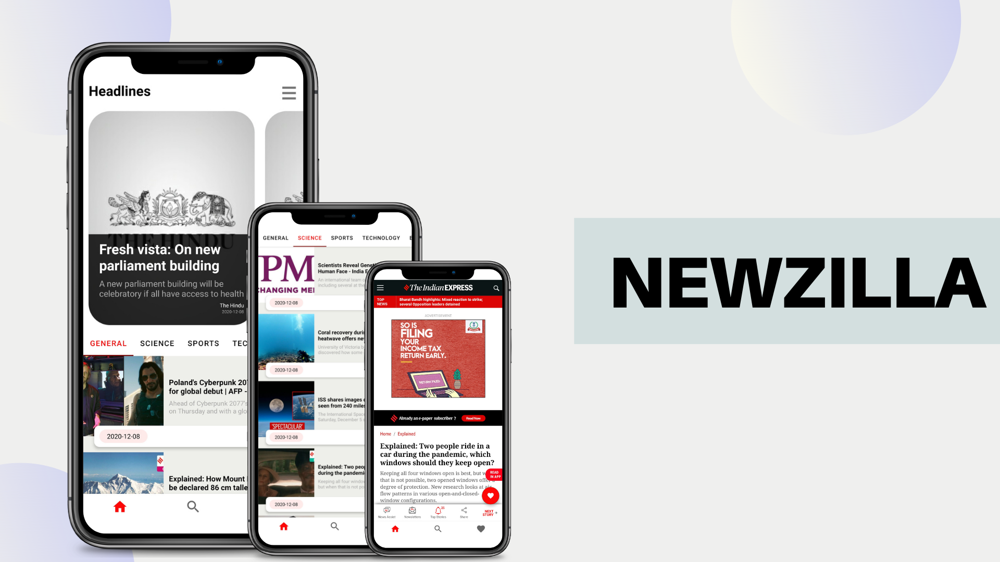
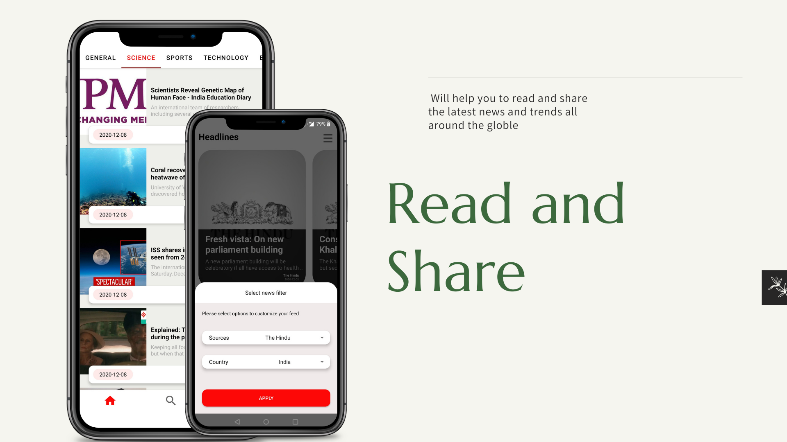
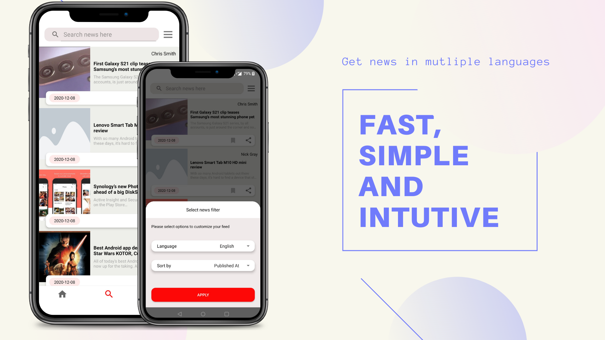
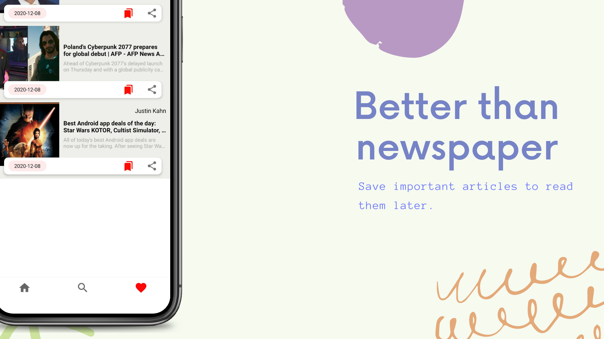

# Newszilla

 Newszilla is newsfeed app that allows you to read, and share the information you need to stay ahead of the trends in the entire world. It uses newsapi.org API to get news
 

# Setup API Key
- Visit NewsAPI.org to get your API Key
- Copy your API Key from accounts section
- Open app/src/main/java/com/hilt/newszilla/utils/AppConstants.kt 
- And add following line:

    var API_KEY = "Use your api key here"
  

# Screenshots

